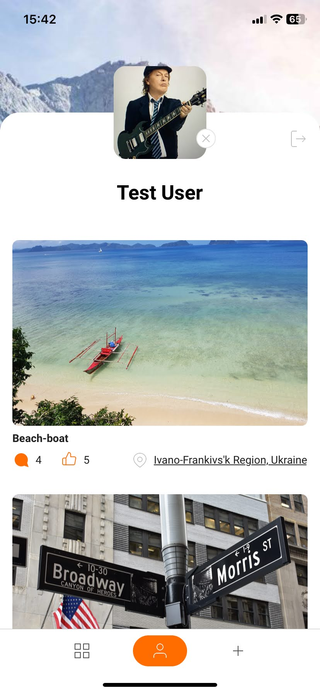

# Scenary

<!-- {width="30%"} -->

Scenary is a social media clone app. Written with Expo React Native JS.

[Expo Go](https://expo.dev/preview/update?message=feat%3A%20Update%20to%20expo%2051&updateRuntimeVersion=1.0.3&createdAt=2024-05-15T07%3A42%3A37.769Z&slug=exp&projectId=9e4ad268-895b-40e3-9020-712552b48820&group=d481ded0-6fb0-49c9-9154-e4d8f9a2ee97) | [Google Play](https://play.google.com/store/apps/details?id=com.andriiradchenko.scenery)

More technical details in [Scenery Wiki](https://github.com/AndreiRadchenko/scenery/wiki)

[Figma template](https://www.figma.com/file/mmYKX8qM9rkBEsKGgi0zEy/Homework?type=design&node-id=0-1&mode=design&t=fampZB2fHhOeO66O-0)

## Key RN components

1. `expo-image-picker`

   Camera component and image picker (in Create.js screen: ImagePicker.launchCameraAsync, ImagePicker.launchImageLibraryAsync)

2. `@expo/react-native-action-sheet`

   Native menu to choose Camera or Image picker (Take Photo, Choose Photo)
